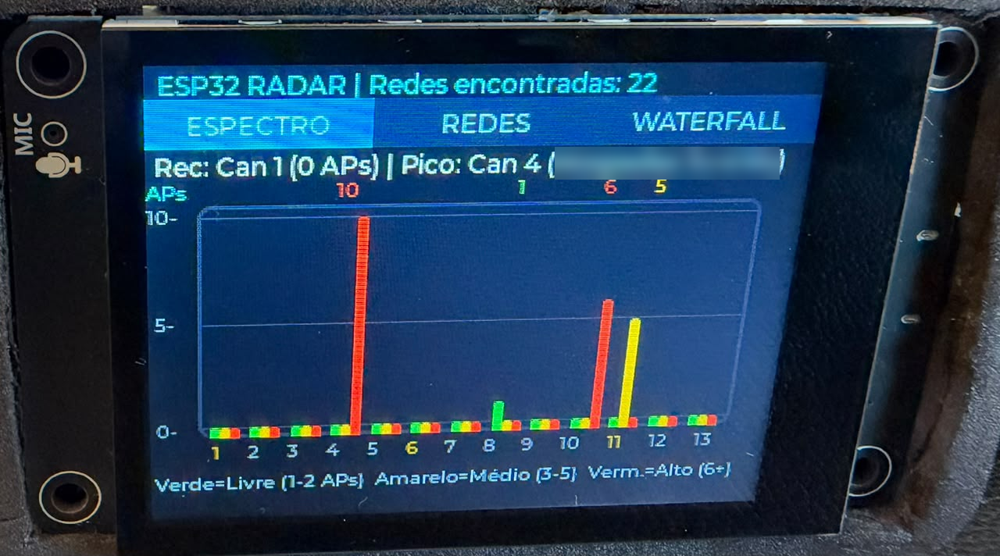
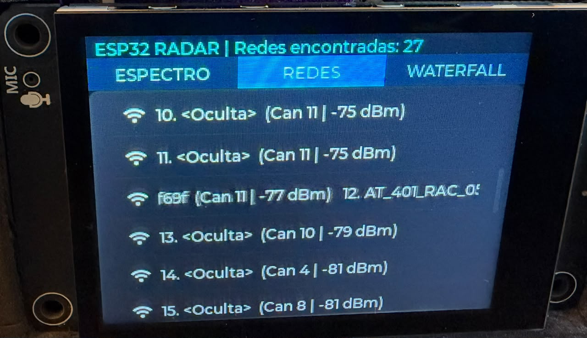
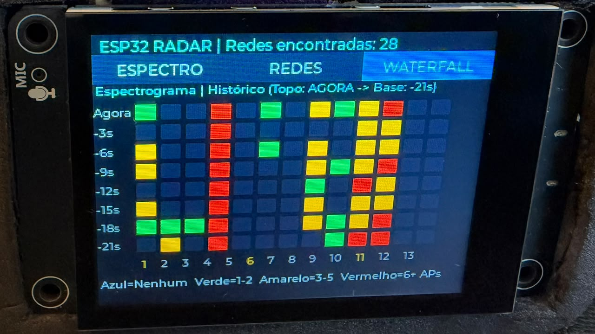

# ESP32 Spectrum Radar — ES3C28P port

- **ES3C28P port:** Murilo Garcia ([@murilogarcia](https://github.com/murilogarcia))
- **Original project:** Earl ([@earlchirchir](https://github.com/earlchirchir)) —
  [earlchirchir/ESP32-Spectrum-Radar](https://github.com/earlchirchir/ESP32-Spectrum-Radar)

A real-time **2.4 GHz Wi-Fi spectrum analyzer** with a rolling **spectrogram waterfall**
and a touch **network inspector**, running on the **ES3C28P** board (ESP32-S3, 2.8"
ILI9341V IPS LCD, FT6336G capacitive touch, 16 MB flash, 8 MB octal PSRAM).
The board is available on [AliExpress](https://a.aliexpress.com/_mN9Ck2B).

This is a port of [earlchirchir/ESP32-Spectrum-Radar](https://github.com/earlchirchir/ESP32-Spectrum-Radar),
which was written for the ESP32-2432S022C "Cheap Yellow Display" (ST7789 + CST816S,
LVGL 9 via `esp32_smartdisplay`). Board details and the full pin map
for this hardware are in the [Hardware](#hardware-es3c28p) section below.







## What it does

At startup a **splash screen** shows the credits and a button for each UI language
(English and Português (BR)). The choice is saved in flash, highlighted on the next boot,
and picked automatically after 10 seconds if nobody touches the screen. Press RESET to
get back to the splash screen and change the language.

The UI then runs in landscape (320×240) with three tabs:

- **SPECTRUM** — bar chart of access points per channel (1–13). Bars are green for 1–2
  APs, yellow for 3–5 and red for 6+. Channels 1, 6 and 11 are highlighted in gold. The
  summary line shows the quietest (recommended) channel and the strongest SSID on the
  busiest channel.
- **DEVICES** — scrollable list of discovered networks (SSID, channel, RSSI). Tapping one
  opens an inspector with BSSID, channel frequency, security type and a signal-quality bar.
  The list keeps its scroll position across scan updates.
- **WATERFALL** — 13×8 heatmap of channel congestion history. A new row is added after
  every scan (every 3 s), so the grid covers the last ~21 s.

The onboard WS2812 LED (GPIO42) runs a rainbow heartbeat to show the firmware is alive.

## Architecture

- **Core 0**: a FreeRTOS task runs a blocking `WiFi.scanNetworks()` every 3 s and fills
  shared tables (network list, per-channel counts, strongest SSID per channel).
- **Core 1**: the Arduino `loop()` runs LVGL and refreshes the UI once per second.
- A mutex guards the shared data. A scan generation counter lets the UI advance the
  waterfall and rebuild the device list only when a new scan has actually completed.

## Project layout

| Path | Purpose |
|---|---|
| [src/main.cpp](src/main.cpp) | Scanner task, UI construction and refresh logic |
| [src/lv_port.cpp](src/lv_port.cpp) | LVGL display flush (TFT_eSPI) and touch input (FT6336), incl. landscape touch mapping |
| [src/led_status.h](src/led_status.h) | WS2812 heartbeat |
| [src/lang/ui_strings_en.cpp](src/lang/ui_strings_en.cpp) | All on-screen text in English (also the fallback for missing translations) |
| [src/lang/ui_strings_pt_br.cpp](src/lang/ui_strings_pt_br.cpp) | All on-screen text in Brazilian Portuguese |
| [src/lang/ui_languages.cpp](src/lang/ui_languages.cpp) | List of languages offered on the splash screen |
| [include/ui_strings.h](include/ui_strings.h) | The string table layout, plus the credits and app title |
| [src/fonts/](src/fonts/) | Montserrat 10/12/14/20 px with Latin accented characters and LVGL symbols |
| [include/pins.h](include/pins.h) | Touch/LED pins and `DISPLAY_ROTATION` |
| [include/lv_conf.h](include/lv_conf.h) | LVGL 8.3 config (fonts, dark theme, heap allocator) |
| [platformio.ini](platformio.ini) | Board, PSRAM/flash layout and TFT_eSPI pin config |
| `lib/` | Vendored TFT_eSPI, LVGL 8.3 and a minimal FT6336 touch driver |

## Porting notes

What changed compared with the original project:

- **Hardware layer replaced.** `esp32_smartdisplay` was dropped in favour of the stack
  already proven on this board: TFT_eSPI for the ILI9341V, a small FT6336 I2C driver and
  LVGL 8.3. The build flags carry over the known fixes for this board, notably
  `-DUSE_HSPI_PORT=1` for the TFT_eSPI crash on ESP32-S3 and `-Iinclude` plus
  `-DLV_CONF_INCLUDE_SIMPLE=1` so LVGL picks up the project config.
- **LVGL 9 → 8.3 API.** For example `lv_button_create` → `lv_btn_create`,
  `lv_obj_delete` → `lv_obj_del`, `lv_tabview_get_tab_bar` → `lv_tabview_get_tab_btns`,
  and the tab bar height is now passed to `lv_tabview_create`.
- **Landscape touch.** The FT6336 always reports portrait coordinates. `lv_port.cpp`
  converts them for the active TFT_eSPI rotation.
- **Bug fixes from the original.**
  - Style colors were set with `LV_OPA_COVER` as the selector, which LVGL reads as a
    state mask, so they never applied. They now use the main part/default state.
  - The waterfall shifted every UI tick (1 s) while scans run every 3 s, so its time labels
    were wrong. It now shifts once per completed scan.
  - The device list was rebuilt every second even without new data. It now rebuilds only
    after a new scan.
  - The inspector is created on LVGL's top layer and closed with an async delete, which is
    safe from inside its own button's event.
  - Emoji and the `→` character are not in the Montserrat fonts. They were replaced with
    `LV_SYMBOL_WIFI` and `->`.
- **Memory.** LVGL allocates from the system heap (`LV_MEM_CUSTOM 1`) and its draw
  buffers live in PSRAM. The 104 waterfall cells share one style object.

## Hardware (ES3C28P)

**Where to buy:** [ES3C28P on AliExpress](https://a.aliexpress.com/_mN9Ck2B). Pick the
capacitive-touch variant (ES3C28P); the ES3N28P has no touch layer.

Manufacturer specs plus what has been confirmed by running on the real board.
"ES3C28P" is the capacitive-touch variant; "ES3N28P" is the same board without the
touch layer. "Confirmed" below means verified on hardware during this board's bring-up.

### Board & SoC

- **MCU:** ESP32-S3, dual-core Xtensa LX7, up to 240MHz
- **Memory:** 384KB ROM + 512KB SRAM + 16KB RTC SRAM + 16MB external QSPI flash +
  8MB octal PSRAM (N16R8) — confirmed working with `board_build.arduino.memory_type =
  qio_opi` in `platformio.ini`; this project keeps LVGL's draw buffers in PSRAM
  ([src/lv_port.cpp](src/lv_port.cpp))
- **Wireless:** WiFi 2.4GHz (802.11 b/g/n, 20/40MHz bandwidth); Bluetooth v4.2 BR/EDR
  + BLE — both confirmed working
- **Power input:** USB Type-C; module operating voltage 3.0–3.6V, board voltage 5.0V

### Display

- 2.8" IPS TFT, 240×320, driver IC **ILI9341V**, 4-wire SPI — confirmed working
- Colors: up to 262K (RGB666); this project uses the common 65K (RGB565)
- Backlight: 4× white LED, ~280 cd/m² typical (230 cd/m² measured with the touch layer)
- Viewing angle: all-around (IPS panel)
- Operating/storage temperature: -30°C to 80°C
- Effective display area: 43.2 × 57.6mm

### Touch

- Capacitive, driver IC **FT6336G**, I2C interface — confirmed working, answers at I2C
  address `0x38` on a live bus scan
- Same 240×320 resolution as the display (reports portrait coordinates regardless of
  display rotation)
- Operating/storage temperature: -30°C to 80°C

### Audio

Not used by this project; listed for completeness.

- Codec: **ES8311** — confirmed working (I2C control at address `0x18`, shared with the
  touch bus; I2S data path)
- Amplifier: commonly cited as an **FM8002E** for this board family, not independently
  confirmed. Enable pin GPIO1 is **active-LOW** (confirmed).
- Built-in MEMS microphone wired to the codec's ADC input
- External speaker via a 2-pin JST connector (speaker included in the box)

### Storage

- 16MB onboard QSPI flash (see `board_build.partitions` in `platformio.ini`)
- microSD (TF) card slot, SDIO 4-bit — pins from the community BSP, **unverified**

### Power & battery

- USB Type-C for both programming and power
- LiPo battery connector + onboard charge management circuit: 4.2–6.5V charging input
  (5V typical), 500mA max charge current (290mA measured), 4.24V charge saturation
  voltage, max charging temperature 62°C
- Battery: 3.7V Li-Po (not included)
- Battery voltage sense on GPIO9 (ADC) — confirmed working
- Power draw (manufacturer figures): ~140mA / 0.7W with only the display active, up to
  ~560mA / 2.8W with display + speaker + battery charging at once

### Other

- WS2812B RGB status LED (GPIO42) — confirmed working, used here as a heartbeat
- BOOT and RESET buttons — BOOT (GPIO0) doubles as manual recovery during flashing if the
  automatic USB reset doesn't take (hold BOOT, tap RESET, release BOOT)
- Debug UART0 header: TX=GPIO44, RX=GPIO43 (unverified; this project uses the native
  USB-CDC serial console via `-DARDUINO_USB_CDC_ON_BOOT=1`)
- Physical dimensions: module with touch layer 50 × 86 × 10.6mm

### Pin map

| Subsystem | Signal | GPIO | Status |
|---|---|---|---|
| Display (SPI) | MISO | 13 | Confirmed working |
| Display (SPI) | MOSI | 11 | Confirmed working |
| Display (SPI) | SCLK | 12 | Confirmed working |
| Display (SPI) | CS | 10 | Confirmed working |
| Display (SPI) | DC | 46 | Confirmed working |
| Display (SPI) | RST | shared with chip reset (`-1`) | Confirmed working |
| Display | Backlight | 45 | Confirmed working |
| Touch (I2C) | SDA | 16 | Confirmed working |
| Touch (I2C) | SCL | 15 | Confirmed working |
| Touch (I2C) | RST | 18 | Confirmed working |
| Touch (I2C) | INT | 17 | Defined, not used (touch is polled) |
| Touch | I2C address | `0x38` | Confirmed via live bus scan |
| Audio (I2S) | MCLK | 4 | Unused |
| Audio (I2S) | BCLK | 5 | Confirmed working |
| Audio (I2S) | LRCK / WS | 7 | Confirmed working |
| Audio (I2S) | DOUT (to speaker) | 8 | Confirmed working — **corrected**, community BSP had this as `6` |
| Audio (I2S) | DIN (from mic) | 6 | Unverified — **corrected**, community BSP had this as `8` |
| Audio | Amp enable | 1 | Confirmed working, **active-LOW** (LOW=enable) |
| Audio (I2C) | Codec address | `0x18` | Confirmed via live bus scan + register read-back |
| SD card (SDIO) | CLK / CMD / D0–D3 | 38 / 40 / 39 / 41 / 48 / 47 | Unverified — from community BSP |
| RGB LED | Data | 42 | Confirmed working (WS2812B) |
| Battery | ADC sense | 9 | Confirmed working |
| Debug UART0 | TX / RX | 44 / 43 | Unverified |
| Boot | BOOT button | 0 | Manual flashing recovery only |

Sources: the manufacturer's product spec sheet, the community BSP repo
[ngttai/esp32_s3_es3c28p](https://github.com/ngttai/esp32_s3_es3c28p) (display, touch and
I2C correct; audio data pins swapped and amp-enable polarity inverted), the manufacturer's
LCD Wiki page (https://www.lcdwiki.com/2.8inch_ESP32-S3_Display, used to correct the audio
pins), and live verification on the board (I2C bus scans, ES8311 register read-back, each
feature working).

## Translating the UI

Every piece of text shown on screen lives in a language file in [src/lang/](src/lang/).
Each file fills in one `UiStrings` table. The Brazilian Portuguese file,
[src/lang/ui_strings_pt_br.cpp](src/lang/ui_strings_pt_br.cpp), is a complete example:

```cpp
#include "ui_strings.h"

UiStrings UI_STRINGS_PT_BR = {
    .language_name          = "Português (BR)",
    .choose_language        = "Escolha o idioma",
    .splash_subtitle        = "Analisador de espectro Wi-Fi 2,4 GHz",
    // ...
    .tab_spectrum           = "ESPECTRO",
    .tab_devices            = "REDES",
    .tab_waterfall          = "WATERFALL",
    // ...
    .inspector_info_fmt     = "BSSID: %s
"
                              "Canal: %u (%.3f GHz)
"
                              "Segurança: %s
"
                              "Sinal: %d dBm (%d%% - %s)",
    // ...
};
```

To add another language, for example Spanish:

1. Copy `src/lang/ui_strings_pt_br.cpp` to `src/lang/ui_strings_es.cpp`, rename the table
   to `UI_STRINGS_ES` and translate the text. Keep the fields in the same order, and keep
   every `%s`, `%u`, `%d`, `%.3f` and `%%` placeholder in the same order.
2. Declare it in [include/ui_strings.h](include/ui_strings.h):

   ```cpp
   extern UiStrings UI_STRINGS_ES;
   ```

3. Add it to the list in [src/lang/ui_languages.cpp](src/lang/ui_languages.cpp). It then
   gets its own button on the splash screen:

   ```cpp
   UiStrings* const UI_LANGUAGES[] = {
       &UI_STRINGS_EN,
       &UI_STRINGS_PT_BR,
       &UI_STRINGS_ES,
   };
   ```

Any field left out of a translation shows the English text instead. Save language files
as UTF-8. The fonts in [src/fonts/](src/fonts/) cover ASCII plus the Latin-1 accented
letters (U+00A0–U+00FF), which is enough for Portuguese, Spanish, French, German and
Italian. Other alphabets need fonts regenerated with the
[LVGL font converter](https://lvgl.io/tools/fontconverter); the exact command used is in
the header of each font file. The screen is only 320 px wide, so keep translations
about as long as the English text.

## Building & flashing

Requires PlatformIO (VS Code extension or CLI):

```
pio run                # build
pio run -t upload      # build + flash over USB-C
pio device monitor     # serial log at 115200 baud
```

If the automatic reset does not enter the bootloader, hold BOOT, tap RESET, release BOOT.

## Hardware status

The firmware compiles cleanly for this board. It has not yet been checked on the physical
board. Things to verify on first boot:

- **Touch orientation.** If taps land mirrored, change `DISPLAY_ROTATION` in
  [include/pins.h](include/pins.h) from `1` to `3` (flips the screen 180°), or adjust the
  mapping in [src/lv_port.cpp](src/lv_port.cpp).
- **Layout.** Positions follow the original 320×240 design. LVGL 8's default theme
  metrics differ slightly from LVGL 9, so small alignment tweaks may be needed.

## License

This project is released under the [MIT License](LICENSE). The original ESP32 Spectrum
Radar by Earl states the MIT License in its README; this port keeps that license and adds
its own copyright line.

Third-party components keep their own licenses:

| Component | Where | License |
|---|---|---|
| [LVGL](https://github.com/lvgl/lvgl) 8.3 | `lib/lvgl/` | MIT, see [LICENCE.txt](lib/lvgl/LICENCE.txt) |
| [TFT_eSPI](https://github.com/Bodmer/TFT_eSPI) by Bodmer | `lib/TFT_eSPI/` | FreeBSD/MIT, see [license.txt](lib/TFT_eSPI/license.txt) |
| [Montserrat](https://github.com/JulietaUla/Montserrat) font, converted to LVGL format | `src/fonts/` | SIL Open Font License 1.1, see [OFL-Montserrat.txt](src/fonts/OFL-Montserrat.txt) |
| [Font Awesome Free](https://fontawesome.com) icons (LVGL symbols), converted to LVGL format | `src/fonts/` | SIL Open Font License 1.1, see [LICENSE-FontAwesome.txt](src/fonts/LICENSE-FontAwesome.txt) |
